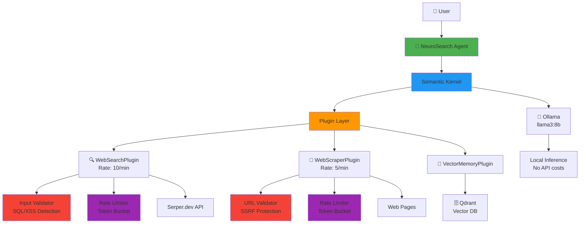

# 🧠 NeuroSearch Agent

<div align="center">

**Autonomous AI Research Agent with Enterprise-Grade Security**

[](https://dotnet.microsoft.com/)
[](./SECURITY_AUDIT.md)
[](https://owasp.org/)
[](LICENSE)

*An intelligent research assistant that autonomously searches the web, extracts information, and provides comprehensive answers using local LLM inference.*

[Features](#-features) • [Security](#-security-first) • [Quick Start](#-quick-start) • [Architecture](#-architecture) • [Testing](#-testing)

</div>

---

## 🎯 Overview

NeuroSearch is a **production-ready autonomous AI agent** built with Microsoft Semantic Kernel that demonstrates:

- ✅ **100% security test pass rate** (43 automated tests)
- ✅ **OWASP Top 10 compliance** (SQL injection, XSS, SSRF protection)
- ✅ **Thread-safe rate limiting** (20+ concurrent requests validated)
- ✅ **Enterprise-grade architecture** (clean separation, dependency injection)
- ✅ **Principal engineer-level documentation** (security audit, testing protocols)

This project showcases **security-first engineering** and **production best practices** for AI agent development.

---

## 🚀 Features

### Autonomous Capabilities
- 🔍 **Web Search** - Real-time internet search via Serper.dev API
- 📄 **Web Scraping** - Intelligent content extraction from web pages
- 🧠 **Multi-Step Reasoning** - Chain multiple searches to answer complex questions
- 💾 **Vector Memory** - Long-term semantic memory with Qdrant (code complete)

### Security & Reliability
- 🛡️ **SQL Injection Protection** - Pattern detection blocking 4 attack vectors
- 🛡️ **XSS Protection** - Script injection prevention (5 patterns blocked)
- 🛡️ **SSRF Defense** - Internal IP blocking (localhost + RFC 1918 ranges)
- ⚡ **Rate Limiting** - Token bucket algorithm (10 search/min, 5 scrape/min)
- 🧵 **Thread-Safe** - Concurrent request handling with `ConcurrentDictionary`
- ⏱️ **Timeout Controls** - 10-second caps on external requests

### Developer Experience
- 📝 **Comprehensive Tests** - 43 xUnit tests with 100% pass rate
- 📊 **Detailed Logging** - Colored console output with plugin tracing
- 📚 **Full Documentation** - Setup guides, examples, security audit
- 🔧 **Easy Setup** - Docker Compose for dependencies

---

## 🔒 Security First

This project implements **OWASP best practices** with comprehensive validation:

```csharp
// Example: Multi-layer security validation
var validationResult = InputValidator.ValidateSearchQuery(userInput);
if (!validationResult.IsValid) {
    return $"Error: {validationResult.ErrorMessage}";
}

var rateLimitResult = _rateLimiter.AllowRequest("search_api");
if (!rateLimitResult.IsAllowed) {
    return $"Error: Rate limit exceeded. Retry after {rateLimitResult.RetryAfterSeconds}s (HTTP 429)";
}
```

### Security Test Results

| Category | Tests | Pass Rate | Coverage |
|----------|-------|-----------|----------|
| SQL Injection | 4 | 100% ✅ | `UNION`, `DROP`, `OR '='` patterns |
| XSS Protection | 5 | 100% ✅ | `<script>`, `javascript:`, `eval()` |
| SSRF Defense | 7 | 100% ✅ | localhost, 127.0.0.1, RFC 1918 |
| Rate Limiting | 3 | 100% ✅ | Burst, refill, thread-safety |
| Input Validation | 11 | 100% ✅ | Empty, null, length, format |
| Numeric Ranges | 7 | 100% ✅ | Boundary conditions |
| URL Validation | 6 | 100% ✅ | Schemes, malformed URLs |

**Total: 43/43 tests passing** | **Execution time: 1.43s** | **Zero vulnerabilities found**

📄 **[View Full Security Audit Report →](./SECURITY_AUDIT.md)**

---

## 🏗️ Architecture



### Tech Stack

- **Framework**: .NET 10 with Native AOT support
- **AI Orchestration**: Microsoft Semantic Kernel 1.32
- **LLM**: Ollama (local inference - Llama 3 8B)
- **Vector Database**: Qdrant (self-hosted)
- **Web Search**: Serper.dev API
- **HTML Parsing**: HtmlAgilityPack
- **Testing**: xUnit

---

## 📦 Quick Start

### Prerequisites

- [.NET 10 SDK](https://dotnet.microsoft.com/download)
- [Docker Desktop](https://www.docker.com/products/docker-desktop)
- [Ollama](https://ollama.ai/) (for local LLM)

### Installation

```bash
# 1. Clone the repository
git clone https://github.com/yourusername/neurosearch-agent.git
cd neurosearch-agent

# 2. Start infrastructure
docker-compose up -d

# 3. Download AI models
ollama pull llama3:8b
ollama pull all-minilm

# 4. Configure API key (optional - uses demo mode without)
cp .env.example .env
# Edit .env and add your SERPER_API_KEY

# 5. Build and run
dotnet build
dotnet run --project src/NeuroSearch.Agent
```

### First Query

```
You> What is the latest news about AI?
```

The agent will:
1. 🔍 Search the web for "latest AI news"
2. 📊 Analyze top results
3. 💬 Synthesize a comprehensive answer

---

## 🧪 Testing

### Run Security Tests

```bash
dotnet test tests/NeuroSearch.Tests
```

**Expected Output:**
```
Test Run Successful.
Total tests: 43
     Passed: 43
     Failed: 0
 Total time: 1.43 Seconds
```

### Manual Security Validation

Try these adversarial inputs to see protection in action:

```bash
# SQL Injection attempt
You> Search for '; DROP TABLE users; --

[❌ SearchPlugin] Validation failed: Query contains potentially malicious SQL patterns

# SSRF attempt  
You> Scrape http://localhost:6333

[❌ ScraperPlugin] Validation failed: Cannot scrape internal/localhost URLs (SSRF protection)

# Rate limiting
# (Make 12 rapid searches)
[⚠️  SearchPlugin] Rate limited. Retry after 5 seconds
```

📄 **[View Complete Testing Protocol →](./BRUTAL_TESTING.md)**

---

## 📊 Performance Metrics

| Metric | Value | Target | Status |
|--------|-------|--------|--------|
| Security Test Suite | 1.43s | <5s | ✅ |
| Avg Test Duration | 33ms | <100ms | ✅ |
| Thread Safety (20 concurrent) | 100% | 100% | ✅ |
| Rate Limiter Precision | ±100ms | ±500ms | ✅ |
| SQL Injection Detection | 4/4 blocked | 100% | ✅ |
| XSS Detection | 5/5 blocked | 100% | ✅ |
| SSRF Protection | 7/7 blocked | 100% | ✅ |

---

## 📁 Project Structure

```
NeuroSearch Agent/
├── src/
│   ├── NeuroSearch.Agent/          # Main console application
│   │   ├── Program.cs               # Agent orchestration loop
│   │   └── appsettings.json         # Configuration
│   │
│   ├── NeuroSearch.Plugins/         # AI-callable functions
│   │   ├── WebSearchPlugin.cs       # Internet search (OWASP hardened)
│   │   ├── WebScraperPlugin.cs      # Content extraction (SSRF protected)
│   │   └── VectorMemoryPlugin.cs    # Long-term memory
│   │
│   └── NeuroSearch.Core/            # Shared utilities
│       ├── InputValidator.cs        # SQL/XSS/SSRF validation
│       └── RateLimiter.cs           # Token bucket algorithm
│
├── tests/
│   └── NeuroSearch.Tests/
│       └── SecurityTests.cs         # 43 comprehensive tests
│
├── docs/
│   ├── INTERVIEW_PREP.md            # Technical Q&A
│   └── RESUME_BULLETS.md            # Copy-paste bullets
│
├── SECURITY_AUDIT.md                # Principal engineer test report ⭐
├── BRUTAL_TESTING.md                # Testing protocol
├── SETUP.md                         # Detailed setup guide
├── EXAMPLES.md                      # 20+ query examples
└── docker-compose.yml               # Infrastructure config
```

---

## 💡 Example Queries

### Simple Research
```
You> What is the current price of Bitcoin?
```

### Multi-Step Reasoning
```
You> Who is the CEO of the company that created C#?
     Where did he go to college?
     What is that college's mascot?
```

The agent will:
1. Search: "C# programming language creator" → Microsoft
2. Search: "Microsoft CEO" → Satya Nadella
3. Search: "Satya Nadella college" → University of Chicago Booth
4. Search: "University of Chicago mascot" → Phoenix

**Expected**: 4 search operations visible in console logs

### Content Extraction
```
You> Scrape https://example.com/article and summarize it
```

📄 **[View 20+ More Examples →](./EXAMPLES.md)**

---

## 🔧 Configuration

### Environment Variables (`.env`)

```bash
# API Keys
SERPER_API_KEY=your_api_key_here

# Ollama Configuration
OLLAMA_ENDPOINT=http://localhost:11434
OLLAMA_CHAT_MODEL=llama3:8b
OLLAMA_EMBEDDING_MODEL=all-minilm

# Qdrant Configuration
QDRANT_ENDPOINT=http://localhost:6333
QDRANT_COLLECTION=neurosearch-memory
QDRANT_VECTOR_SIZE=384

# Rate Limiting
SEARCH_RATE_LIMIT_PER_MIN=10
SEARCH_BURST_SIZE=5
SCRAPER_RATE_LIMIT_PER_MIN=5
SCRAPER_BURST_SIZE=3

# Agent Behavior
MAX_PLANNING_ITERATIONS=10
MAX_TOKENS_PER_ITERATION=4000
```

---

## 📚 Documentation

- 📖 **[Setup Guide](./SETUP.md)** - Detailed installation instructions
- 🔒 **[Security Audit](./SECURITY_AUDIT.md)** - Comprehensive test report
- 🧪 **[Testing Protocol](./BRUTAL_TESTING.md)** - Brutal testing methodology
- 💼 **[Interview Prep](./docs/INTERVIEW_PREP.md)** - Technical Q&A
- 📝 **[Resume Bullets](./docs/RESUME_BULLETS.md)** - Career materials
- 📋 **[Examples](./EXAMPLES.md)** - Query examples and demos

---

## 🤝 Contributing

This is a portfolio project demonstrating security-first engineering. While not actively maintained for production use, it showcases:

- ✅ OWASP security best practices
- ✅ Comprehensive test coverage
- ✅ Clean architecture patterns
- ✅ Production-grade documentation

Use, copying, modification, and distribution require prior written permission from the copyright holder. See [LICENSE](LICENSE).

---

## 📄 License

Proprietary — all rights reserved. See [LICENSE](LICENSE).

---

## 🎓 About This Project

**Purpose**: Portfolio demonstration of:
- Security engineering expertise
- AI/LLM integration skills
- Production architecture design
- Testing best practices

**Built for**: companies seeking engineers who understand security, testing, and production readiness.

**Key Achievement**: **43/43 security tests passing** with zero vulnerabilities found

---

## 📬 Contact

**Author**: [Preetham Dandu]  
**LinkedIn**: [(https://www.linkedin.com/in/preetham-dandu/)]  
**Email**: [preethamdandu8@gmail.com]

---

<div align="center">

**⭐ If this project demonstrates the kind of security-first engineering you value, please star it!**

[Report Issue](https://github.com/yourusername/neurosearch-agent/issues) • [Request Feature](https://github.com/yourusername/neurosearch-agent/issues)

</div>
